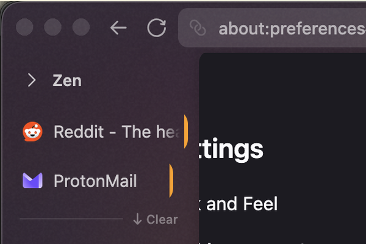
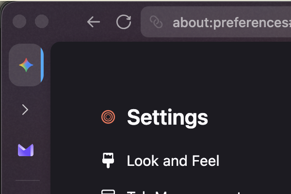
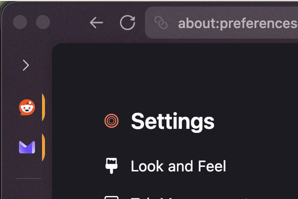

# gvr-zen-mods

Small CSS utility mods for [Zen Browser](https://zen-browser.app).

## Mods

| Mod | Preview | Version | Description |
|-----|---------|---------|-------------|
| [pinned-in-rail](pinned-in-rail/) |  | 1.0.1 | Keeps loaded pinned tabs visible in the rail when the workspace section is collapsed |
| [pin-align](pin-align/) |  | 1.0.4 | Fixes pinned folder-tab icon alignment in the collapsed rail |
| [active-first](active-first/) |  | 1.0.1 | Sorts inactive tabs to the bottom when expanded; hides them in the collapsed rail |
| [essentials-bottom](essentials-bottom/) |  | 1.0.8 | Moves essentials tabs to the bottom of the sidebar |
| [tab-containers](tab-containers/) |  | 1.0.60 | Tile geometry in collapsed rail; instant collapse |
| [rail-selected-ring](rail-selected-ring/) |  | 1.3.3 | Collapsed-rail tile tint and selected cap ring |
| [clean-sidebar-header](clean-sidebar-header/) |  | 1.0.0 | Hides the title bar in extension sidebars |

Registry previews are `screenshot.png` in each mod folder (600×400 PNG, per [Zen Mods submission guidelines](https://docs.zen-browser.app/themes-store/themes-marketplace-submission-guidelines)).

Companions for **`zen-sidebar-expand-on-hover`** (external fork). Recommended ship order:

`expand-on-hover` → `pinned-in-rail` → `pin-align` → `essentials-bottom` → `tab-containers` → `rail-selected-ring`

## Install

```bash
python3 install.py              # all mods in this repo
python3 install.py tab-containers   # one mod
```

**expand-on-hover** is not in this repo — install from `~/Repos/zen-sidebar-expand-on-hover` (or Zen Mods UI) **before** these companions. See ship stack order in root `NOTES.md`.

Restart Zen Browser after installing.
