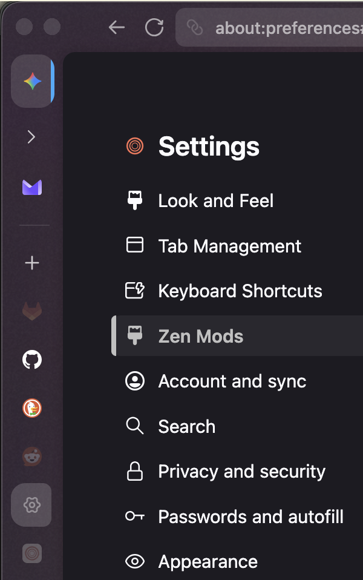
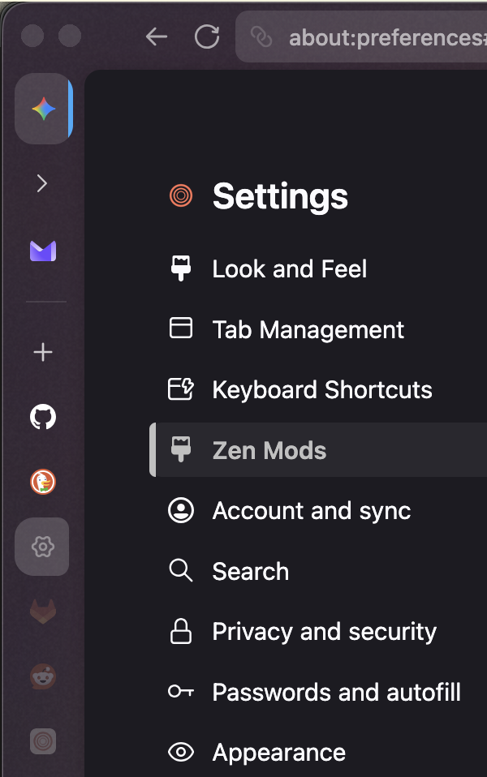
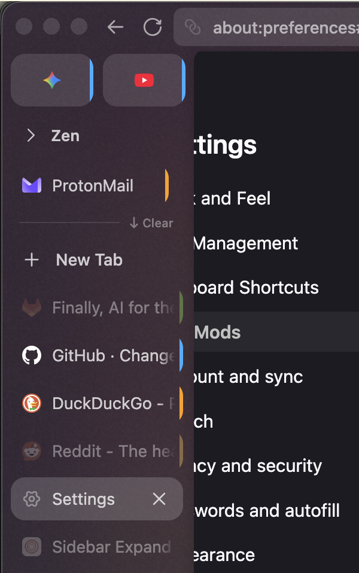
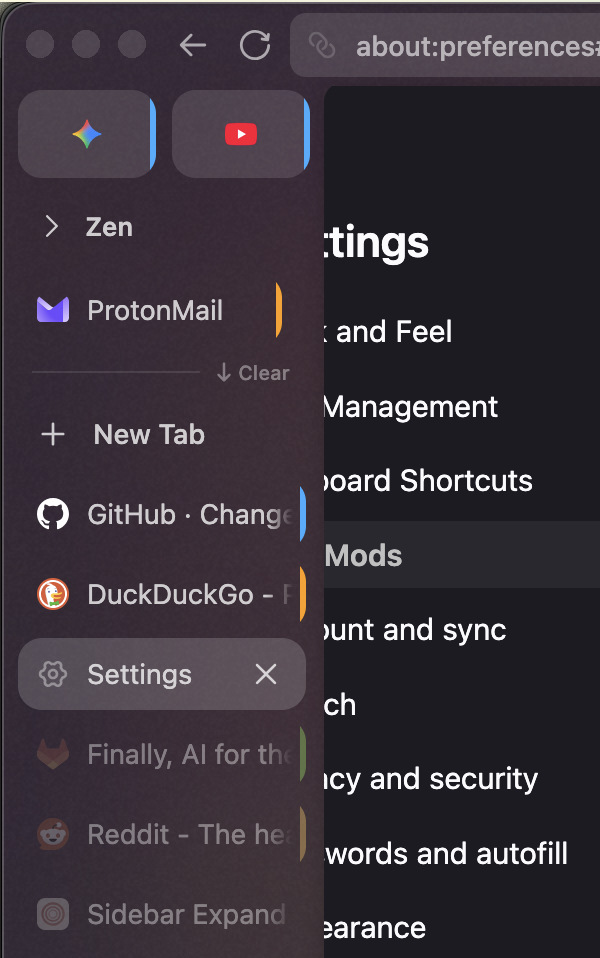

# [GVR] Active First

**Version:** 1.0.1

Sorts inactive unpinned tabs to the bottom of the workspace list when the sidebar is expanded. In the collapsed rail, inactive tabs can be hidden so only loaded tabs stay visible; they reappear when you hover to expand the sidebar.

Companion for `zen-sidebar-expand-on-hover`.


Expanded sidebar — loaded tabs above, inactive tabs dimmed at the bottom.

## Preferences

- **Hide inactive tabs in rail** (`hide_inactive_in_rail`, default: on) — inactive unpinned tabs are hidden in the collapsed sidebar and revealed on hover expand.

## Screenshots

### Collapsed rail

Mouse off the sidebar. **Before:** dim unloaded tabs (GitLab, Reddit) still sit in the rail. With the mod on, **`hide_inactive_in_rail` off** keeps them; **on** (default) hides them.

| Before | Pref off (keep unloaded) | Pref on (default) |
|---|---|---|
|  |  |  |

### Expanded sidebar

Inactive tabs move from the main list to the bottom of the workspace section.

| Before | After |
|---|---|
|  |  |

## Install

From the repo root:

```bash
python3 install.py active-first
```

Restart Zen Browser to apply.
