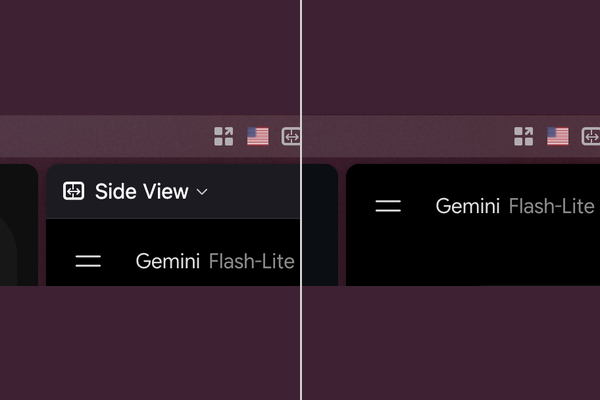

# [GVR] Clean Sidebar Header

**Version:** 1.0.0

Hides the persistent title bar in extension sidebars for a cleaner, minimalist look. Tested with [Side View](https://addons.mozilla.org/en-US/firefox/addon/side-view/), but applies to other extension sidebars too.



## Install

From the repo root:

```bash
python3 install.py clean-sidebar-header
```

Restart Zen Browser to apply.

Or install from the [Zen Mods Registry](https://zen-browser.app/mods/) — search for **Clean Sidebar Header**.
