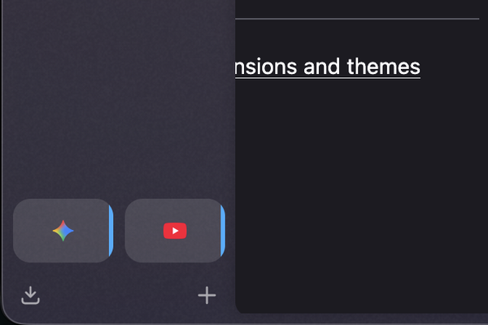
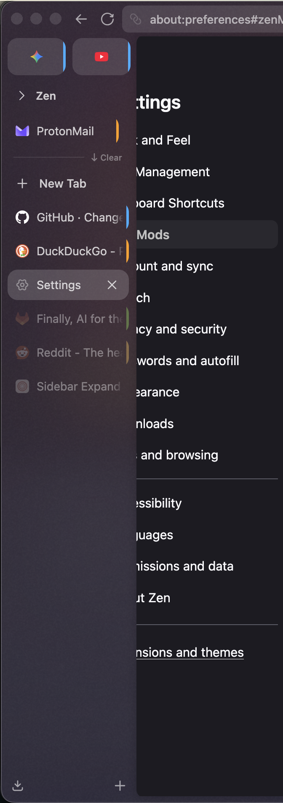
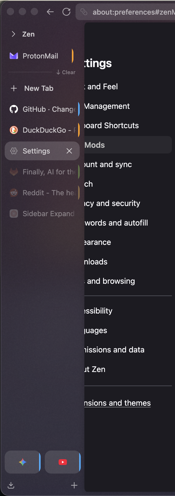

# [GVR] Essentials Bottom

**Version:** 1.0.8

Moves essentials tabs to the bottom of the vertical sidebar, below workspace tabs.



## Screenshots

Expanded sidebar. Before: essentials grid (star, YouTube, etc.) sits above the workspace tab list. After: essentials are pinned below the scrollable workspace area.

| Before | After |
|---|---|
|  |  |

## Install

From the repo root:

```bash
python3 install.py essentials-bottom
```

Restart Zen Browser to apply.
