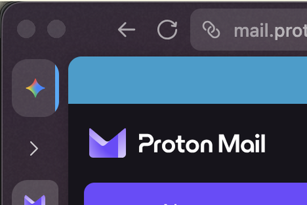
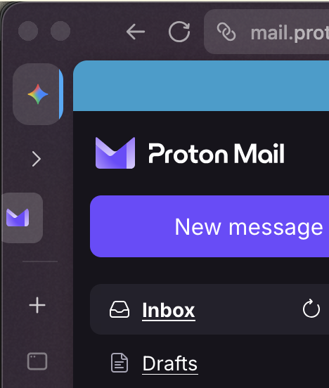
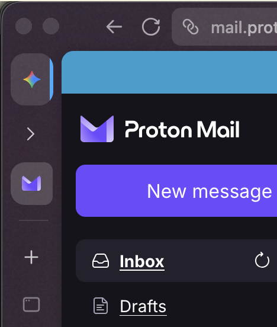

# [GVR] Pin Align

**Version:** 1.0.4

Fixes pinned folder-tab icon alignment in the collapsed rail when workspace sections are hidden. Prevents icons from shifting on sidebar hover.

Companion for `zen-sidebar-expand-on-hover`.



## Screenshots

Collapsed rail with a top-level pin and a pin inside a folder (`collapsedpinnedtabs`). Alignment is subtle at this crop — compare the folder pin icon to its neighbors.

| Before (without mod) | After (with mod) |
|---|---|
|  |  |

Without pin-align, folder pins sit slightly off compared to top-level pins and can jump when the sidebar expands on hover. With the mod, icons stay on the same vertical axis.

## Install

From the repo root:

```bash
python3 install.py pin-align
```

Restart Zen Browser to apply.
