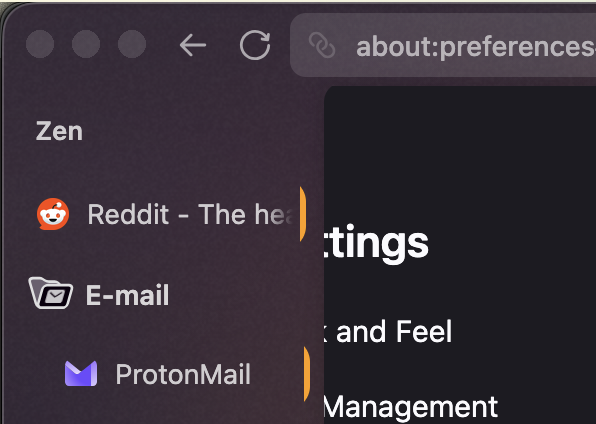
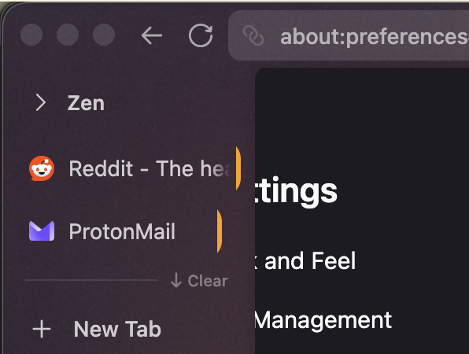

# [GVR] Pinned In Rail

**Version:** 1.0.1

Keeps all loaded (non-pending) pinned tabs visible as icons in the rail when a workspace's pinned section is collapsed.

Companion for `zen-sidebar-expand-on-hover`.


Expanded workspace with pins (left) → collapsed rail keeps both icons (right).

When the workspace pinned section is collapsed, only non-pending pinned tab icons are shown. Folder labels and pending tabs are hidden.

## Screenshots

Workspace with a top-level pin and a pin inside a folder. **Before:** expanded sidebar — both pins visible in the workspace list. **After:** sidebar collapsed — both pins remain as icons in the rail (tile width is refined by `tab-containers` in the ship stack).

| Before (expanded) | After (collapsed rail) |
|---|---|
|  |  |

## Install

From the repo root:

```bash
python3 install.py pinned-in-rail
```

Restart Zen Browser to apply.
