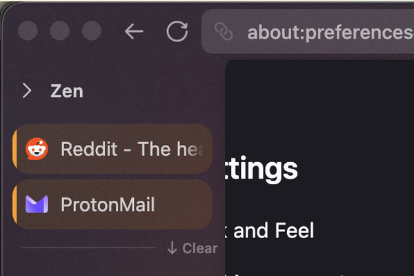
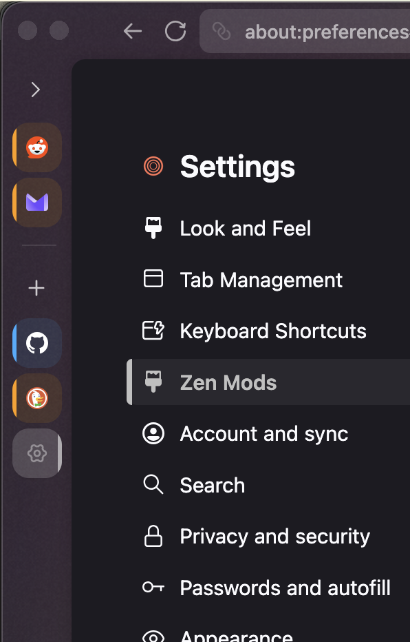

# [GVR] Rail Selected Ring

**Version:** 1.3.3

Collapsed sidebar rail: subtle tile backgrounds + straight cap bars on selected tabs.

Companion for `tab-containers` and expand-on-hover. Install after tab-containers.



## Mod settings

Open **Zen Mods** → **[GVR] Rail Selected Ring**.

**Tile tint:** background fill, opacity, optional container color.

**Tab hover matches idle style:** when on, hovering a tab in the collapsed rail keeps the same tint/opacity/caps as idle (unselected → unselected caps, selected → selected caps). Off = slightly brighter hover tint on unselected tabs.

**Caps:** eight independent edge toggles — four for **Selected** (default on) and four for **Unselected** (default off).

Container tabs use identity color for caps; **right cap** on a left sidebar controls the native container stripe.

## Screenshots

**Before** uses the tab-containers stack only (tiles + stripes, no cap bars). **After** adds tile tint and straight cap bars on the selected tab.

| Before (tab-containers only) | After (collapsed rail) |
|---|---|
|  |  |

## Install

```bash
python3 install.py rail-selected-ring
```

Restart Zen Browser to apply.
