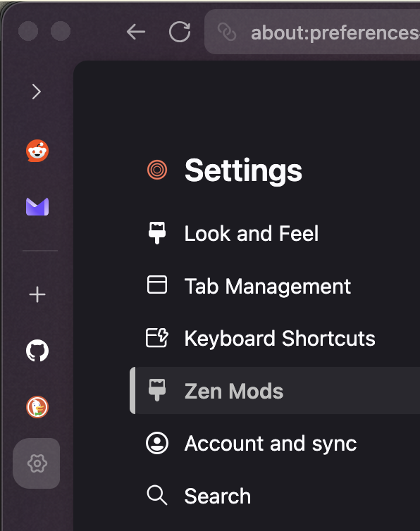
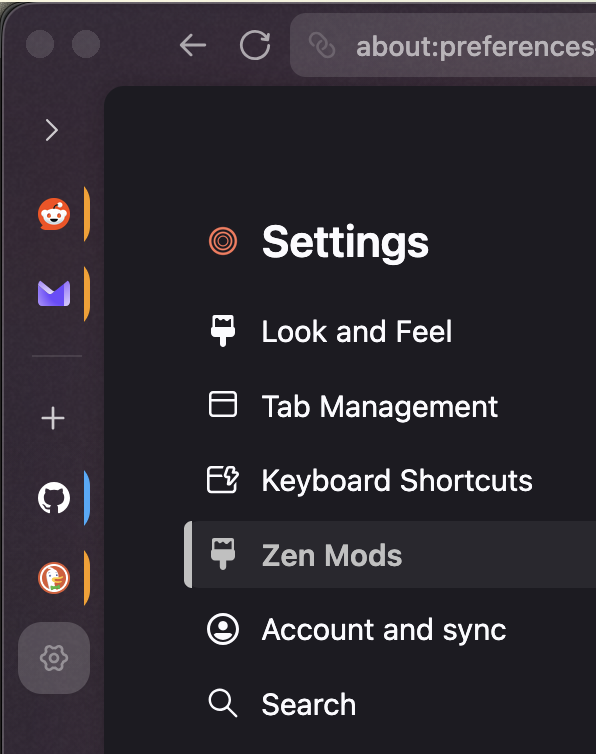
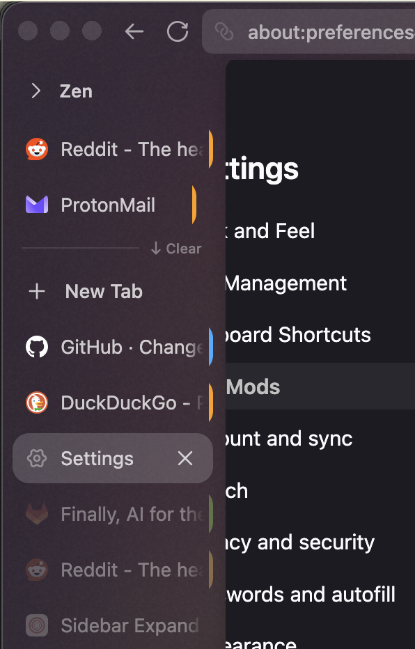
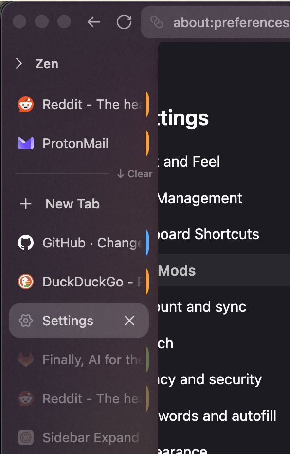

# [GVR] Tab Containers

**Version:** 1.0.60

Keeps essentials-style tile backgrounds on workspace pinned and normal tabs in the collapsed rail.

Companion for `zen-sidebar-expand-on-hover`, which clips non-essential tab backgrounds down to favicon-only slivers when the sidebar is collapsed. Works well with `essentials-bottom`.


## Behavior

- Rounded tile backgrounds on pinned and normal workspace tabs in collapsed rail
- Tile sizing and margins match essentials
- Favicons centered within each tile
- Playing-audio tabs: mute hidden in collapsed rail by default (favicon stays centered); optional pref for top-right speaker overlay
- Container identity stripes on tile edges
- Tab width eases with sidebar collapse (expand-on-hover delay + duration)
- Tab close button hidden in collapsed rail (returns when the sidebar expands on hover)

## Screenshots

### Collapsed rail

Expand-on-hover clips tabs to favicon slivers without this mod. With tab-containers, tabs get square tiles and container color stripes.

| Before | After |
|---|---|
|  |  |

### Expanded sidebar (width alignment)

Same stack with the sidebar expanded. The after shot fixes row width so pinned and normal tabs align with the workspace indicator and tab margins.

| Before | After |
|---|---|
|  |  |

## Install

From the repo root:

```bash
python3 install.py tab-containers
```

Restart Zen Browser to apply.
